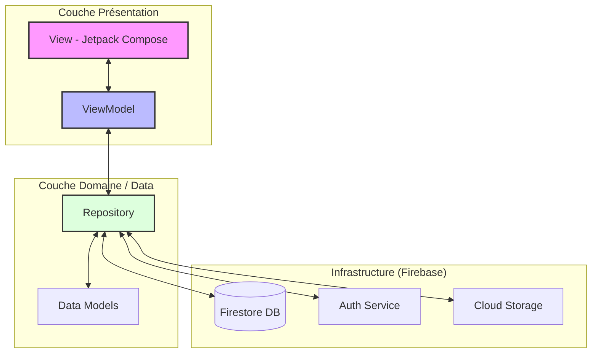
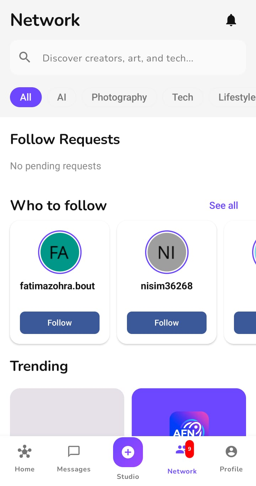
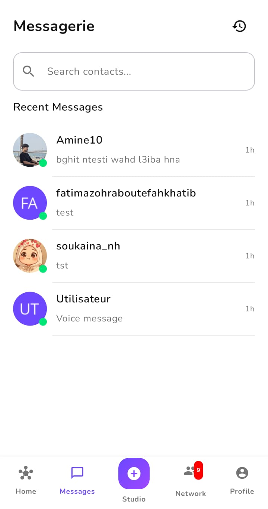

# SocialApp  - Projet Mobile Groupe 15

SocialApp est une plateforme de réseau social Android moderne permettant de partager des moments, de découvrir de nouveaux contenus via un algorithme de recommandation intelligent et de communiquer en temps réel.

##  Membres de l'équipe
- BOUTEFAH KHATIB Fatima Zohra
- NHAILA Soukina
- HOUMADA Mohamed El Amine

##  Description du projet
L'application vise à offrir une expérience sociale complète intégrant les dernières technologies Android. Elle se distingue par son flux "For You" qui utilise un système de scoring personnalisé pour proposer du contenu pertinent à l'utilisateur, tout en garantissant une interface fluide et réactive grâce à Jetpack Compose.

### Fonctionnalités principales
- **Système de Feed Double** : Onglet "Following" pour ses abonnements et "For You" pour la découverte de nouveaux comptes.
- **Stories** : Partage de moments éphémères avec navigation tactile et barre de progression.
- **Messagerie Instantanée** : Chat en temps réel supportant le texte, les images, les GIFs (Giphy) et les messages vocaux.
- **Appels** : Fonctionnalité d'appels voix et vidéo intégrée.
- **Algorithme de Recommandation** : Système de scoring basé sur l'engagement (likes, commentaires), la récence (decay factor) et la proximité sociale (amis d'amis).
- **Gestion de Profil** : Personnalisation, suivi d'utilisateurs et historique d'activité.

## 🏗️ Architecture du projet

L'application est construite en suivant les principes de la **Clean Architecture** et du pattern **MVVM (Model-View-ViewModel)**. Cette approche garantit une séparation stricte des responsabilités, facilitant la maintenance, les tests et l'évolutivité.

### 📐 Découpage en couches

#### 1. Presentation Layer (Interface Utilisateur)
*   **Jetpack Compose** : Utilisation d'une UI 100% déclarative pour une interface moderne et réactive.
*   **ViewModels** : Gèrent l'état de l'UI (UI State) et transforment les événements utilisateur en actions métier. Ils s'appuient sur `LiveData` ou `StateFlow` pour notifier l'UI des changements.
*   **Unidirectional Data Flow (UDF)** : Les événements circulent vers le haut (UI → ViewModel) et l'état circule vers le bas (ViewModel → UI).

#### 2. Domain / Repository Layer (Logique Métier)
*   **Repositories** : Agissent comme une source unique de vérité. Ils orchestrent la logique métier complexe :
    *   **Recommendation Engine** : Algorithme de scoring pour le flux "For You".
    *   **Chat Manager** : Gestion des messages temps réel et des statuts de lecture.
    *   **Follow System** : Logique de relations sociales et de proximité.
*   **Models** : Entités de données pures (POJO/Data Classes) utilisées dans toute l'application.

#### 3. Data Layer (Sources de Données)
*   **Firebase Firestore** : Stockage structuré pour les documents utilisateurs, posts et conversations.
*   **Firebase Authentication** : Gestion sécurisée des identités et sessions.
*   **Firebase Storage** : Hébergement des médias (images, audio des messages vocaux).

### 🔄 Schéma de l'Architecture

### 💉 Injection de Dépendances
Le projet utilise **Hilt (Dagger)** pour l'injection de dépendances. Cela permet de :
- Découpler les composants (ex: injecter un Repository dans un ViewModel).
- Faciliter les tests unitaires en permettant le "mocking" des dépendances.
- Gérer proprement le cycle de vie des objets au sein de l'application Android.

## Dépendances principales
Le projet utilise les bibliothèques suivantes (gestion via Gradle) :
- **Jetpack Compose** (Material 3) : Pour l'interface utilisateur déclarative.
- **Hilt** : Pour l'injection de dépendances.
- **Firebase** :
    - *Firestore* : Base de données NoSQL en temps réel.
    - *Authentication* : Gestion des comptes utilisateurs.
    - *Storage* : Stockage des images et médias.
- **Coil** : Chargement d'images asynchrone.
- **Media3 (ExoPlayer)** : Lecture des contenus audio/vidéo.
- **Coroutines & Flow** : Gestion de l'asynchronisme.

## Captures d'écran

| Authentification | Accueil | Réseau |
| :---: | :---: | :---: |
|  |  |  |

| Liste Conversations | Chat | Profil |
| :---: | :---: | :---: |
|  |  |  |

---
## Installation
1. Clonez le dépôt : `git clone https://github.com/votre-repo/SocialApp.git`
2. Ajoutez votre fichier `google-services.json` dans le dossier `app/`.
3. Compilez avec **Android Studio Ladybug (ou version ultérieure)**.