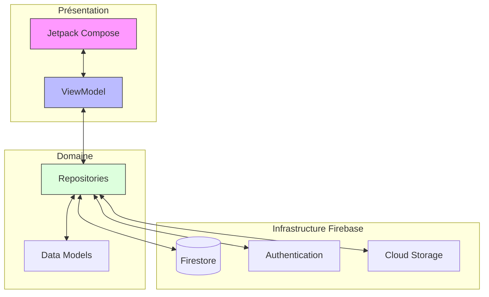
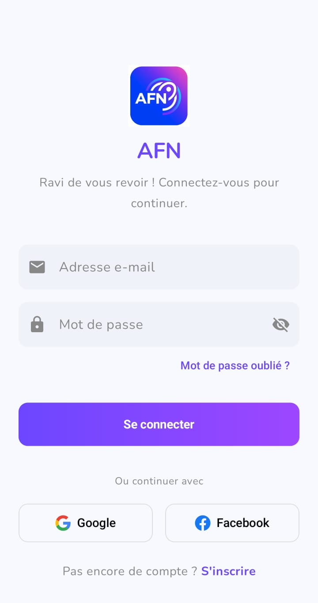
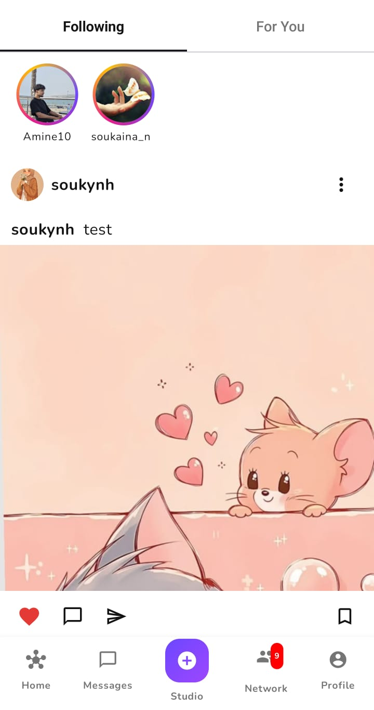
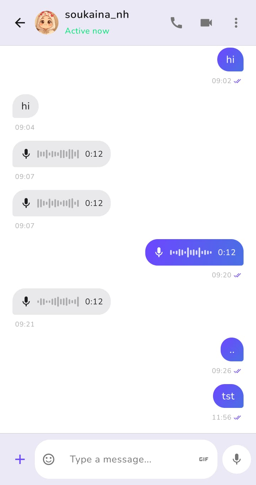
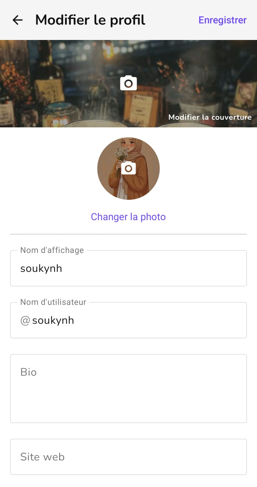

# SocialApp — Projet Mobile Groupe 15

> **Réseau social Android** favorisant l'interaction et le partage de contenu entre utilisateurs.  
> Publication, messagerie et système de recommandations personnalisées.

---

## Membres de l'équipe

| Nom & Prénom | Rôle |
|---|---|
| BOUTEFAH KHATIB Fatima Zohra | Développeuse Mobile |
| HOUMADA Mohamed El Amine | Développeur Mobile |
| NHAILA Soukina | Développeuse Mobile |

---

## Description du projet

SocialApp est une plateforme de réseau social Android moderne permettant de :
- Partager des **posts** (texte et/ou image) avec son audience
- Découvrir du nouveau contenu via un **algorithme de recommandation** ("For You")
- **Interagir** en temps réel : likes, commentaires, stories éphémères
- **Communiquer** via une messagerie instantanée (texte, images, GIFs, audio)
- **Suivre** d'autres utilisateurs et gérer son réseau social

---

## Fonctionnalités principales

### Feed & Posts
- **Double onglet** : "Following" (abonnements) et "For You" (découverte)
- Création de post texte seul, image seule, ou texte + image
- Double-tap sur une image pour liker avec animation cœur
- Sauvegarde de posts (bookmark) avec onglet dédié dans le profil
- Partage de post en story, par message ou via Intent natif Android

### Stories
- Création de stories avec photo, texte et filtre
- Visionneuse plein écran avec barres de progression par story
- Navigation par tap (gauche/droite) et pause par long press
- Défilement automatique (5 secondes par story)

### Algorithme de recommandation "For You"
```
score = (likes × 2) + (commentaires × 3) − decay(âge) + bonus_proximité_sociale
```
- `decay` : `1.5 × ln(1 + heures)` — pénalise les anciens posts progressivement
- `bonus_proximité_sociale` : +8 pts par ami en commun
- Recalcul réactif via `combine(allPostsFlow, followingFlow)`

### Profil utilisateur
- Photo de profil + bannière personnalisable
- Statistiques : publications, abonnés, abonnements
- Onglets : Publications / Enregistrés / Taguées / Reels
- Navigation vers le profil depuis commentaires et listes d'abonnés

### Messagerie
- Chat en temps réel (Firestore `addSnapshotListener`)
- Support texte, images, GIFs (Giphy), messages vocaux
- Appels voix et vidéo intégrés
- Envoi de lien de post directement dans un chat

### Authentification
- Inscription / Connexion classique (email + mot de passe)
- Single Sign-On via **Google** (Credential Manager) et **Facebook**
- Vérification d'email avec bannière de rappel
- Onboarding : date de naissance, genre, centres d'intérêt

### Notifications
- Notifications temps réel (likes, commentaires, abonnements)
- Badge de compteur sur l'onglet réseau

---

## Architecture du projet

L'application suit la **Clean Architecture** avec le pattern **MVVM**.

```
┌─────────────────────────────────────────┐
│         Presentation Layer              │
│  Jetpack Compose UI  ←→  ViewModel      │
│  (LiveData / StateFlow / UDF)           │
└───────────────────┬─────────────────────┘
                    │
┌───────────────────▼─────────────────────┐
│         Domain / Repository Layer       │
│  PostRepository   FeedRepository        │
│  CommentRepository  MessageRepository   │
│  RecommendationRepository               │
│  FollowRepository  NotificationRepo     │
└───────────────────┬─────────────────────┘
                    │
┌───────────────────▼─────────────────────┐
│         Data Layer (Firebase)           │
│  Firestore DB  │  Auth  │  Storage      │
└─────────────────────────────────────────┘
```



### Structure des packages

```
com.Groupe15.SocialApp/
├── di/                  → Injection de dépendances (Hilt)
├── models/              → Entités : Post, Story, User, Comment, Message…
├── repository/          → Sources de données & logique métier
├── service/             → Firebase Messaging, ReplyReceiver
├── ui/
│   ├── auth/            → Login, Register, Onboarding
│   ├── discover/        → Écran de découverte
│   ├── feed/            → FeedScreen, PostCard, Comments, Share
│   ├── messages/        → Chat, Appels
│   ├── network/         → Réseau social, suggestions
│   ├── notifications/   → Centre de notifications
│   ├── post/            → Création de post
│   ├── profile/         → Profil, édition, abonnés/abonnements
│   └── story/           → Création et visionneuse de stories
├── viewmodel/           → FeedViewModel, ProfileViewModel…
└── MainActivity.kt      → Navigation Compose (NavHost)
```

---

## Stack technique

| Technologie | Usage |
|---|---|
| **Kotlin** | Langage principal |
| **Jetpack Compose + Material 3** | UI déclarative |
| **Hilt (Dagger)** | Injection de dépendances |
| **Firebase Firestore** | Base de données NoSQL temps réel |
| **Firebase Auth** | Authentification (email, Google, Facebook) |
| **Firebase Storage** | Stockage images et audios |
| **Firebase Cloud Messaging** | Notifications push |
| **Coil** | Chargement d'images asynchrone |
| **Media3 / ExoPlayer** | Lecture audio/vidéo |
| **Coroutines + Flow** | Gestion de l'asynchronisme |
| **Navigation Compose** | Navigation entre écrans |

---

## Dépendances — `build.gradle`

Les bibliothèques principales à ajouter si besoin :

```kotlin
// Compose + Material 3
implementation("androidx.compose.material3:material3")

// Hilt
implementation("com.google.dagger:hilt-android:2.48")
kapt("com.google.dagger:hilt-android-compiler:2.48")

// Firebase
implementation(platform("com.google.firebase:firebase-bom:32.x.x"))
implementation("com.google.firebase:firebase-firestore-ktx")
implementation("com.google.firebase:firebase-auth-ktx")
implementation("com.google.firebase:firebase-storage-ktx")
implementation("com.google.firebase:firebase-messaging-ktx")

// Coil
implementation("io.coil-kt:coil-compose:2.x.x")

// Navigation
implementation("androidx.navigation:navigation-compose:2.x.x")

// Credential Manager (Google Sign-In)
implementation("androidx.credentials:credentials:1.x.x")
implementation("com.google.android.libraries.identity.googleid:googleid:1.x.x")
```

---

## Installation

1. Clonez le dépôt :
   ```bash
   git clone https://github.com/votre-repo/Projet-Android-SocialApp.git
   ```
2. Ouvrez le projet dans **Android Studio Ladybug** (ou version ultérieure)
3. Ajoutez votre fichier `google-services.json` dans le dossier `app/`
4. Synchronisez Gradle et lancez l'application sur un émulateur ou appareil réel (API 26+)

---

## Captures d'écran

| Authentification | Accueil | Réseau |
| :---: | :---: | :---: |
|  |  |  |

| Liste Conversations | Chat | Profil |
| :---: | :---: | :---: |
|  |  |  |

---

*Université Abdelmalek Essaâdi — Faculté Polydisciplinaire de Larache*  
*Master DevOps et Cloud Computing — Année Universitaire 2025/2026*  
*Encadrant : Pr. KOUISSI Mohamed*